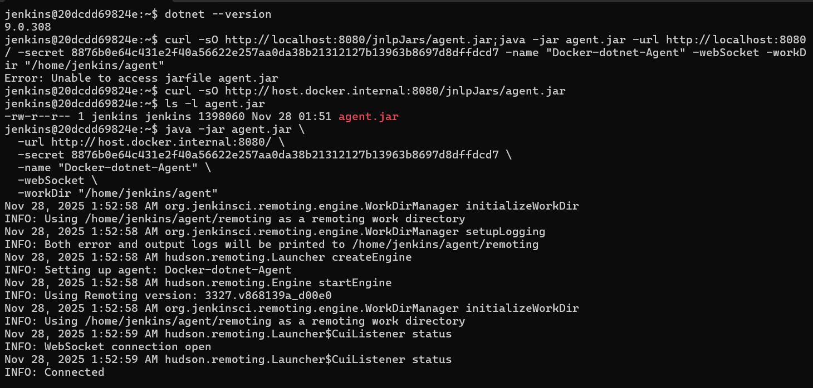
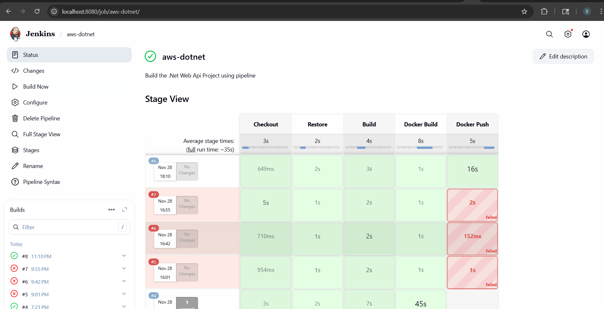
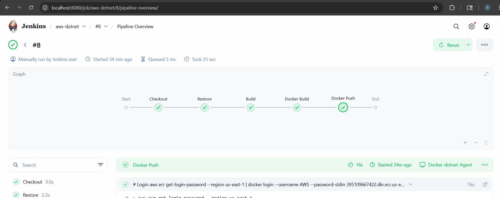

# Deploy .NET Web API Docker Image to AWS ECR using Jenkins Pipeline

This guide walks you through setting up Jenkins with a custom Docker agent to deploy .NET Web API applications to AWS ECR.

## Prerequisites

- Docker Desktop installed and running
- AWS account with ECR access
- Basic understanding of Jenkins and Docker

## Step 1: Setup Jenkins Controller

### Run Jenkins in Docker Container
```bash
docker run -d --name jenkins -p 8080:8080 -p 50000:50000 jenkins/jenkins:lts
```

### Initial Jenkins Configuration
1. Navigate to `http://localhost:8080`
2. Create a new admin user:
   - Username: `Jenkins-user`
   - Password: `password`
3. Install suggested plugins during initial setup

## Step 2: Create Jenkins Agent Node

Configure a new agent node with the following settings:

- **Name**: `Docker-dotnet-Agent`
- **Number of executors**: `1`
- **Remote root directory**: `/home/jenkins/agent`
- **Labels**: `docker dotnet docker-dotnet-agent`
- **Usage**: Use this node as much as possible
- **Launch method**: Launch agent by connecting it to the controller
- **Availability**: Keep this agent online as much as possible



## Step 3: Build and Run Custom Jenkins Agent

### Build the Agent Docker Image
Use the provided Dockerfile in the `agent/` directory to build your custom Jenkins agent with .NET SDK, Docker, and AWS CLI.

### Run the Agent Container
```bash
docker run -d --name jenkins-dotnet-agent \
  -u 0 \
  -v /var/run/docker.sock:/var/run/docker.sock \
  -v jenkins-agent-work:/home/jenkins/agent \
  jenkins-dotnet-docker-agent \
  -url http://localhost:8080 \
  -secret <your-agent-secret> \
  -name "Docker-dotnet-Agent" \
  -webSocket
```

## Step 4: Verify Agent Setup

### Access the Agent Container
```bash
docker exec -it jenkins-dotnet-agent bash
```

### Verify Required Tools
Check that all required tools are installed:
```bash
# Check Docker
docker --version

# Check .NET SDK
dotnet --version

# Check AWS CLI
aws --version
```

## Step 5: Connect Agent to Jenkins

### Download and Run Agent JAR
```bash
# Download the agent JAR file
curl -sO http://host.docker.internal:8080/jnlpJars/agent.jar

# Verify download
ls -l agent.jar

# Connect the agent
java -jar agent.jar \
  -url http://host.docker.internal:8080/ \
  -secret <your-agent-secret> \
  -name "Docker-dotnet-Agent" \
  -webSocket \
  -workDir "/home/jenkins/agent"
```

You should see "Connected" status in the console output.


## Step 6: Create Jenkins Pipeline

### Setup AWS Credentials
1. Go to Jenkins → Manage Jenkins → Manage Credentials
2. Add AWS credentials with ID: `aws-creds`
3. Include your AWS Access Key ID and Secret Access Key


### Create Pipeline Job
1. Create a new Pipeline job in Jenkins
2. Use the provided Groovy pipeline scripts
3. Configure the pipeline to use your custom agent with label `dotnet`

### Pipeline Features
- Build .NET Web API Docker image
- Push image to AWS ECR
- Support for AWS STS assume role
- S3 bucket listing capabilities

## Step 7: Execute and Monitor Pipeline

1. Click "Build Now" to execute the pipeline
2. Monitor the build progress in the stage view
3. Verify the Docker image is successfully pushed to ECR





## Troubleshooting

- Ensure Docker socket is properly mounted for Docker-in-Docker operations
- Verify AWS credentials have sufficient permissions for ECR operations
- Check agent connectivity if builds fail to start
- Review console logs for detailed error messages

## Security Best Practices

- Use IAM roles with minimal required permissions
- Regularly rotate AWS credentials
- Keep Jenkins and agent images updated
- Use secrets management for sensitive data