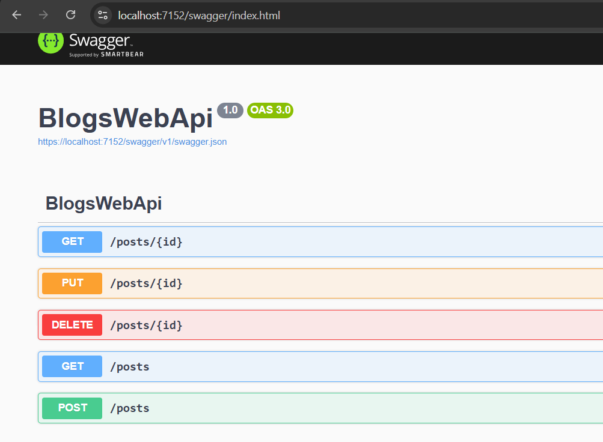
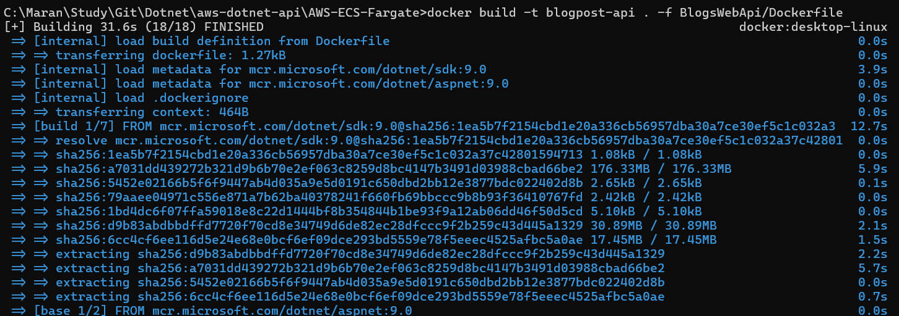
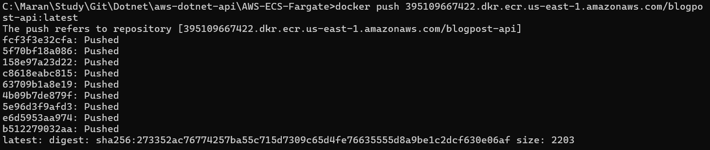
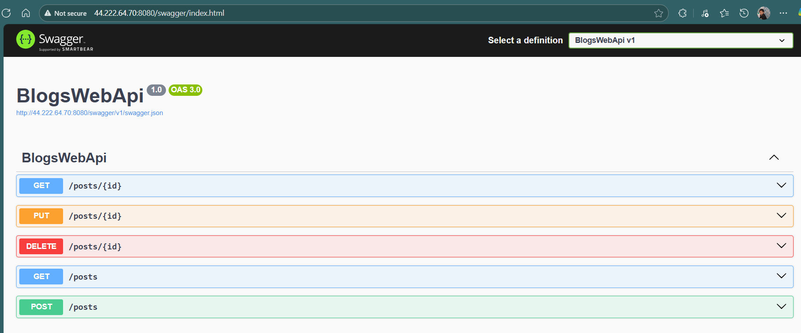
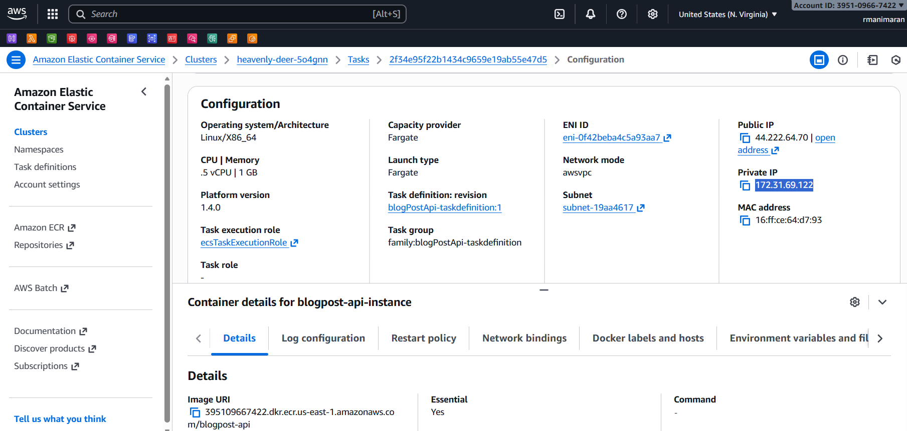
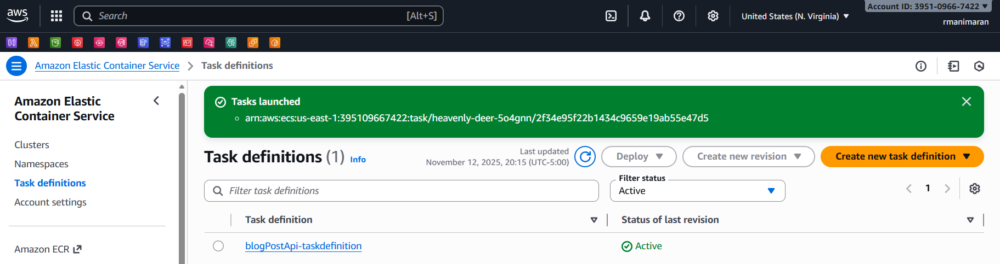
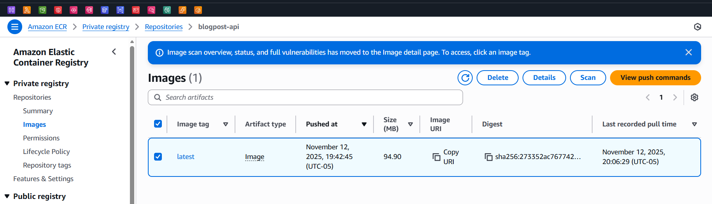

# Deploying .NET Web API to AWS ECS Fargate

This guide walks you through deploying a .NET Web API to AWS using ECR (Elastic Container Registry) and ECS (Elastic Container Service) with Fargate.

## Prerequisites

- AWS CLI installed and configured
- Docker Desktop running
- .NET 9.0 SDK
- AWS account with appropriate permissions

## Step 1: Build Your Docker Image

First, let's build the Docker image for your .NET Web API:

```bash
docker build -t blogpost-api . -f BlogsWebApi/Dockerfile
```



## Step 2: Create ECR Repository

Create a repository in AWS ECR to store your Docker image:

```bash
aws ecr create-repository --repository-name blogpost-api --region us-east-1
```



## Step 3: Authenticate Docker with ECR

Get the login token and authenticate your Docker client:

```bash
aws ecr get-login-password --region us-east-1 | docker login --username AWS --password-stdin <your-account-id>.dkr.ecr.us-east-1.amazonaws.com
```

## Step 4: Tag and Push Image to ECR

Tag your image with the ECR repository URI and push it:

```bash
# Tag the image
docker tag blogpost-api:latest <your-account-id>.dkr.ecr.us-east-1.amazonaws.com/blogpost-api:latest

# Push to ECR
docker push <your-account-id>.dkr.ecr.us-east-1.amazonaws.com/blogpost-api:latest
```



## Step 5: Create ECS Cluster

Create an ECS cluster to run your containers:

```bash
aws ecs create-cluster --cluster-name blogpost-cluster
```



## Step 6: Create Task Definition

Create a task definition that tells ECS how to run your container:

```json
{
  "family": "blogpost-task",
  "networkMode": "awsvpc",
  "requiresCompatibilities": ["FARGATE"],
  "cpu": "256",
  "memory": "512",
  "executionRoleArn": "arn:aws:iam::<your-account-id>:role/ecsTaskExecutionRole",
  "containerDefinitions": [
    {
      "name": "blogpost-api",
      "image": "<your-account-id>.dkr.ecr.us-east-1.amazonaws.com/blogpost-api:latest",
      "portMappings": [
        {
          "containerPort": 8080,
          "protocol": "tcp"
        }
      ],
      "essential": true,
      "logConfiguration": {
        "logDriver": "awslogs",
        "options": {
          "awslogs-group": "/ecs/blogpost-task",
          "awslogs-region": "us-east-1",
          "awslogs-stream-prefix": "ecs"
        }
      }
    }
  ]
}
```

Register the task definition:

```bash
aws ecs register-task-definition --cli-input-json file://task-definition.json
```



## Step 7: Create ECS Service

Create a service to run and maintain your desired number of tasks:

```bash
aws ecs create-service \
  --cluster blogpost-cluster \
  --service-name blogpost-service \
  --task-definition blogpost-task \
  --desired-count 1 \
  --launch-type FARGATE \
  --network-configuration "awsvpcConfiguration={subnets=[subnet-12345],securityGroups=[sg-12345],assignPublicIp=ENABLED}"
```





## Step 8: Create Application Load Balancer (Optional)

For production deployments, create an ALB to distribute traffic:

```bash
# Create load balancer
aws elbv2 create-load-balancer \
  --name blogpost-alb \
  --subnets subnet-12345 subnet-67890 \
  --security-groups sg-12345

# Create target group
aws elbv2 create-target-group \
  --name blogpost-targets \
  --protocol HTTP \
  --port 8080 \
  --vpc-id vpc-12345 \
  --target-type ip
```

## Useful Commands

### Check service status:
```bash
aws ecs describe-services --cluster blogpost-cluster --services blogpost-service
```

### View logs:
```bash
aws logs get-log-events --log-group-name /ecs/blogpost-task --log-stream-name <stream-name>
```

### Update service with new image:
```bash
aws ecs update-service --cluster blogpost-cluster --service blogpost-service --force-new-deployment
```

## Notes

- Replace `<your-account-id>` with your actual AWS account ID
- Update subnet and security group IDs with your VPC resources
- Ensure your security groups allow inbound traffic on port 8080
- The API will be accessible via the ALB DNS name or ECS task public IP

## Troubleshooting

- If tasks fail to start, check CloudWatch logs for error messages
- Ensure your task execution role has permissions to pull from ECR
- Verify security group rules allow the required traffic
- Check that your subnets have internet gateway access for public IPs