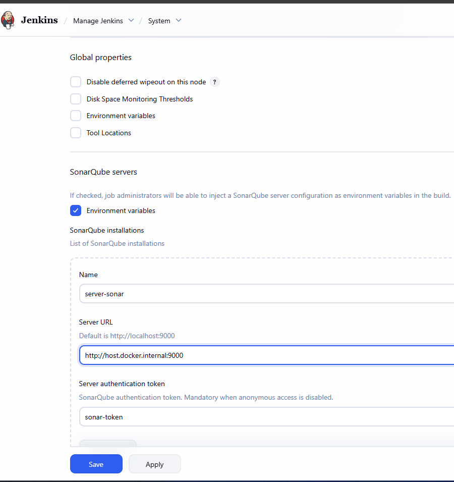
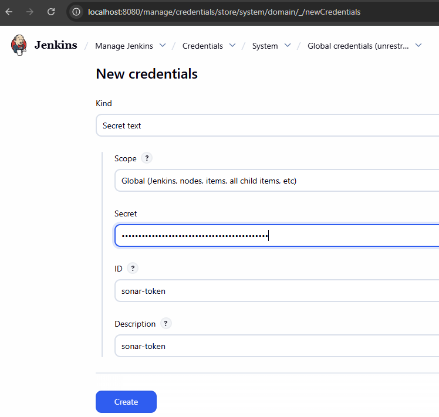
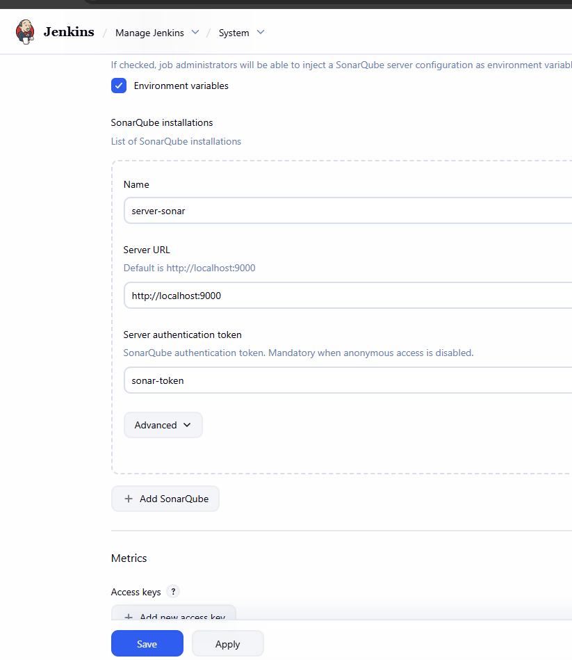
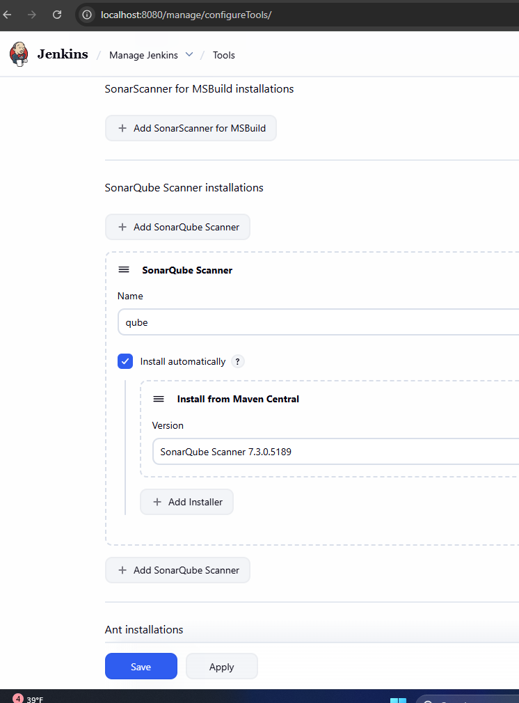
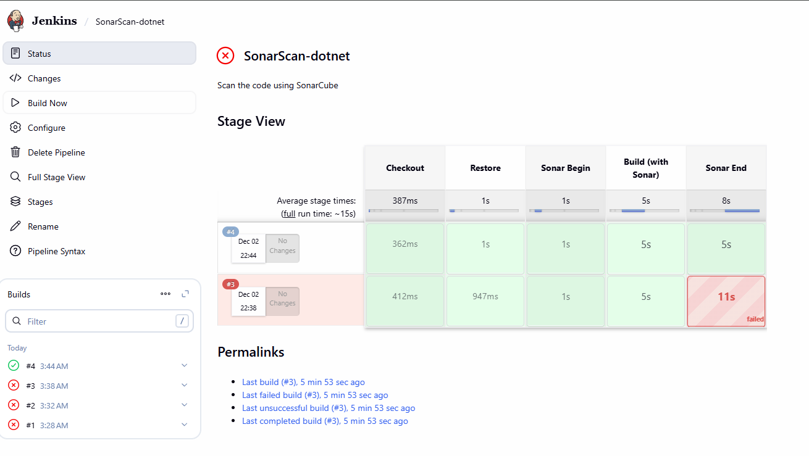
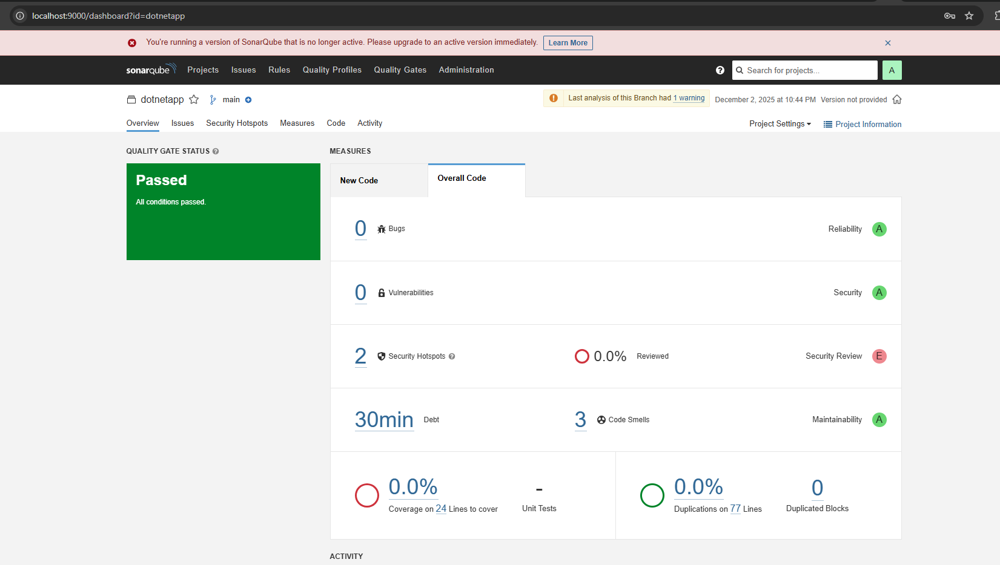

# Integrate Sonarqube in the Jenkins pipeline

### Up Sonarqube server using docker
- Use the docker-compose file to run the sonarqube in the docker 

```bash
docker network create ci-network

docker-compose build

docker-compose up -d
```
- Login to the SonarQube using the URL http://localhost:9000
- Use the credentials as admin/admin.
- On the SonarQube, click manually and create a project.
- Generate a Token and copy the token
- In the Jenkins create the credentials










