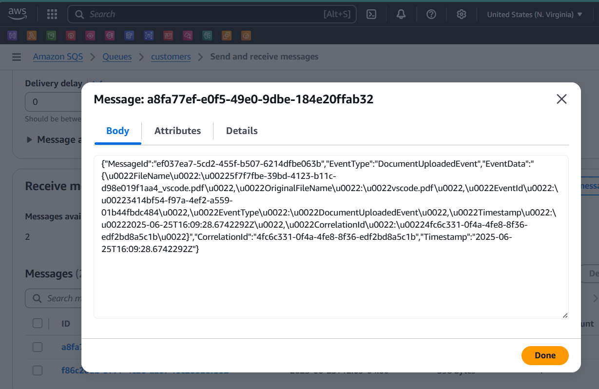

# AWS S3-SQS-SES Integration in .Net Web API

A .NET 9 Web API demonstrating integration with AWS services (S3, SQS, SES) for document upload, storage, and notification processing.

## Features

- **File Upload to S3**: Upload PDF documents to Amazon S3 bucket
- **Email Notifications**: Send email notifications using Amazon SES
- **Message Queuing**: Queue events using Amazon SQS for background processing
- **Background Processing**: Process queued messages using hosted background service
- **Event-Driven Architecture**: Implements event handlers for document upload events

## Architecture

The application follows an event-driven architecture with three main workflows:

1. **Simple Upload**: Direct file upload to S3
2. **Upload with Email**: File upload + immediate email notification
3. **Upload with Queue**: File upload + queue event for background email processing

## API Endpoints

### Document Upload Endpoints

- `POST /api/documents/upload` - Upload PDF file to S3
- `POST /api/documents/upload-and-email` - Upload file and send immediate email
- `POST /api/documents/upload-and-queue` - Upload file and queue for background processing

## Configuration

Update `appsettings.json` with your AWS configuration:

```json
{
  "S3Settings": {
    "BucketName": "your-bucket-name",
    "Region": "us-east-1"
  },
  "SqsSettings": {
    "QueueUrl": "https://sqs.region.amazonaws.com/account-id/queue-name"
  },
  "SESSettings": {
    "AdminEmail": "admin@example.com",
    "SenderEmail": "sender@example.com"
  }
}
```

## Prerequisites

- .NET 9 SDK
- AWS Account with configured credentials
- S3 Bucket
- SQS Queue
- SES verified email addresses

## AWS Services Used

- **Amazon S3**: File storage
- **Amazon SQS**: Message queuing
- **Amazon SES**: Email notifications

## Key Components

- **DocumentEndpoints**: API endpoints for file operations
- **S3FileStorageService**: Handles S3 file operations
- **SesEmailSender**: Manages email sending via SES
- **SqsMessagePublisher**: Publishes events to SQS
- **SqsMessageHandler**: Background service for processing SQS messages
- **DocumentUploadedEventHandler**: Processes document upload events

## Running the Application

1. Configure AWS credentials
2. Update `appsettings.json` with your AWS resources
3. Run the application:
   ```bash
   dotnet run --project ApiService
   ```
4. Access the API at `https://localhost:7xxx`

## Screenshots


*Simple file upload interface*


*File successfully uploaded to S3*


*Upload with immediate email notification*


*Email notification received*


*Upload with SQS queue processing*


*SQS message processing*


*SQS message in Json Viewer*


*Background service processing results*