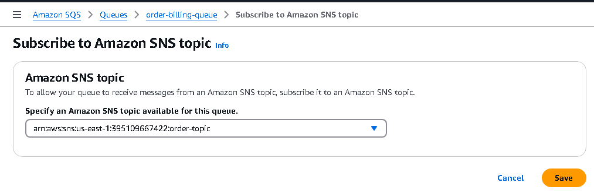
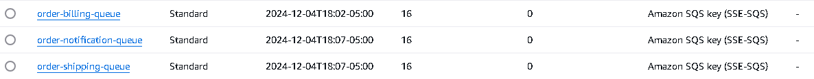

## Using AWS SQS and SNS using multiple consumers with MassTransit in .net App

- This Project demonstrate the usage of AWS SQS and SNS in a .net application using the mass transit.
- Projects Involved:
  - AWS.Orders.Api : Web Api project which expose a endpoint to place the order. Once the Order is placed this will publish the message.
  - There are 3 Consumers.
    - Billing.Consumer :  (.Net Console App) Consumes the message & Performs the Billing Operation for the order placed
    - Shipping.Consumer : (.Net Console App) Consumes the message & performs the Shipping related operation.
    - Notification.Consumer : (.Net Console App) Consume the message & performs the email or notification to the customer.
  
**Architecture**:


**Orders.Api endpoint Request and Response**:


**AWS**:
--------------

- Create a SNS topic and name it as **Order-topic**
  

- Create 3 SQS queue and name it as
  - **order-billing-queue**,
  - **order-shipping-queue**,
  - **order-notification-queue**
- On each queue subscribe to the SNS topic we have created.


- Create a sample test message in the Order-topic and published in the AWS Console. They are available in the SQS queues
  

IAM Policy and User
- Create a IAM Policy which have acess to SQS and SNS operation.
- Create a role and assign the policy.
- Get the Access Key and Secret access Key and configure it in our user secrets file.


**Create User Secrets in the .Net Api Project**:

```bash
> dotnet user-secrets init
> dotnet user-secrets set "AmazonSQS:AccessKey" "<placeAcessKeyhere>"
> dotnet user-secrets set "AmazonSQS:SecretKey" "<placeSecretKehere>"
```

**Try Some publish**:



**Shipping.Consumer**:


**Multiple Consumer running in Parallel**:


