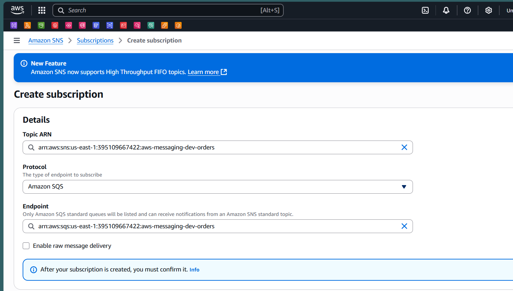

# AWS Messaging with SQS and SNS in .NET 9 Web API

A demonstration project showcasing AWS messaging patterns using the AWS.Messaging library with Amazon SQS, SNS, and EventBridge in a .NET 9 Web API application.

## Features

- **Multiple Publishing Options**: Direct SQS publishing, SNS topic publishing, and EventBridge publishing
- **Message Handling**: Automatic message processing with retry policies
- **Resilience**: Exponential backoff retry mechanism for failed messages
- **Clean Architecture**: Separated concerns with contracts, handlers, and endpoints

## Project Structure

```
MessagingApi/
├── Contracts/
│   └── OrderCreatedEvent.cs      # Message contract
├── Endpoints/
│   └── OrdersEndpoints.cs        # API endpoints
├── Handlers/
│   └── OrderCreatedEventHandler.cs # Message handler
├── Models/
│   └── OrderDto.cs               # Data transfer object
├── AWSResources.cs               # AWS configuration
└── Program.cs                    # Application setup
```

## Prerequisites

- .NET 9 SDK
- AWS Account with appropriate permissions
- AWS CLI configured or AWS credentials set up
- SQS Queue and SNS Topic created in AWS

## Dependencies

- `AWS.Messaging` (v1.0.0)
- `AWS.Messaging.Telemetry.OpenTelemetry` (v0.23.0)

## Configuration

Update `appsettings.json` with your AWS resources:

```json
{
  "AWSResources": {
    "SQSOrderQueueUrl": "https://sqs.us-east-1.amazonaws.com/YOUR-ACCOUNT/your-queue-name",
    "SNSOrderTopicUrl": "arn:aws:sns:us-east-1:YOUR-ACCOUNT:your-topic-name"
  }
}
```

## API Endpoints

### 1. Create Order (Generic Publisher)
**POST** `/api/orders`
- Uses `IMessagePublisher` for flexible message publishing
- Automatically routes to configured publisher (SQS/SNS)

### 2. Publish to SNS Topic
**POST** `/api/orders-publish-topic`
- Uses `ISNSPublisher` to publish directly to SNS topic
- Messages are distributed to all topic subscribers

### 3. Publish to EventBridge
**POST** `/api/orders-publish-evntBridge`
- Uses `IEventBridgePublisher` for event-driven architecture
- Supports complex routing rules

### Request Body Example
```json
{
  "orderId": "ORD-001",
  "customerId": "CUST-123",
  "totalAmount": 99.99,
  "items": ["Item1", "Item2"],
  "orderDate": "2024-01-01T00:00:00Z"
}
```

## Message Flow

1. **API Request**: Client sends order creation request
2. **Message Publishing**: Order event is published to configured AWS service
3. **Message Processing**: Handler processes the message asynchronously
4. **Retry Logic**: Failed messages are retried with exponential backoff

## AWS Setup Screenshots

### Message Publishing Flow

  


### SNS Topic Configuration

*Create Topic*


*Created 1st Subscription to a SQS Queue*


*Created 2nd Subscription to another SQS Queue*

### Message Distribution

*Message Received in 1st Queue*


*Message Received in 2nd Queue*

## Key Implementation Details

### Message Bus Configuration
```csharp
builder.Services.AddAWSMessageBus(bus =>
{
    // SQS Publisher
    bus.AddSQSPublisher<OrderCreatedEvent>(awsResources.SQSOrderQueueUrl);
    
    // SNS Publisher
    bus.AddSNSPublisher<OrderCreatedEvent>(awsResources.SNSOrderTopicUrl);
    
    // Message Consumer
    bus.AddSQSPoller(awsResources.SQSOrderQueueUrl);
    
    // Message Handler
    bus.AddMessageHandler<OrderCreatedEventHandler, OrderCreatedEvent>();
    
    // Retry Policy
    bus.ConfigureBackoffPolicy(cfg => cfg.UseCappedExponentialBackoff());
});
```

### Message Handler
- Implements `IMessageHandler<OrderCreatedEvent>`
- Returns `MessageProcessStatus` for success/failure handling
- Includes error handling and logging

## Running the Application

1. Clone the repository
2. Update AWS configuration in `appsettings.json`
3. Run the application:
   ```bash
   dotnet run --project MessagingApi
   ```
4. Test endpoints using the provided HTTP requests

## Benefits of AWS.Messaging Library

- **Simplified Configuration**: Easy setup for AWS messaging services
- **Built-in Resilience**: Automatic retry mechanisms
- **Multiple Publishers**: Support for SQS, SNS, and EventBridge
- **Type Safety**: Strongly typed message contracts
- **Observability**: Built-in telemetry support