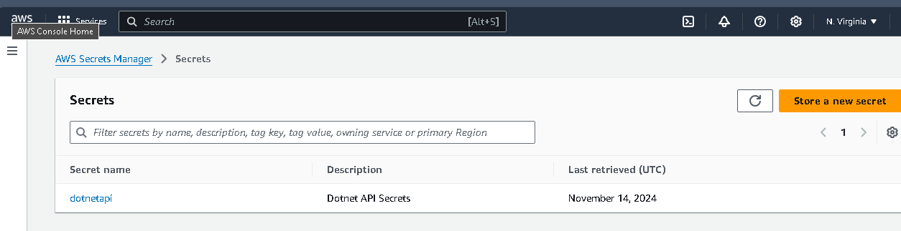
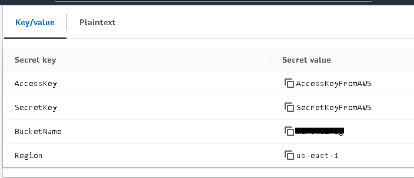
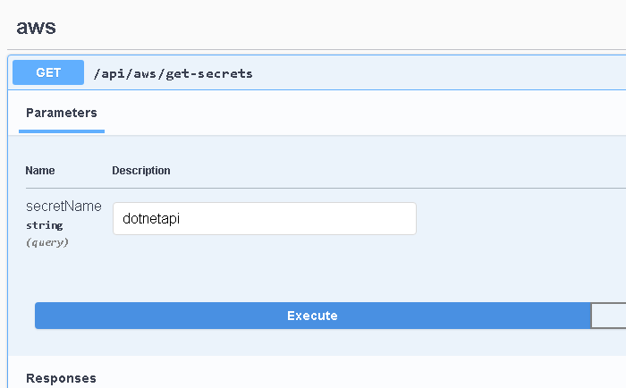
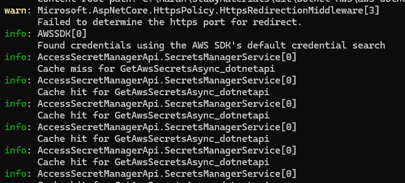
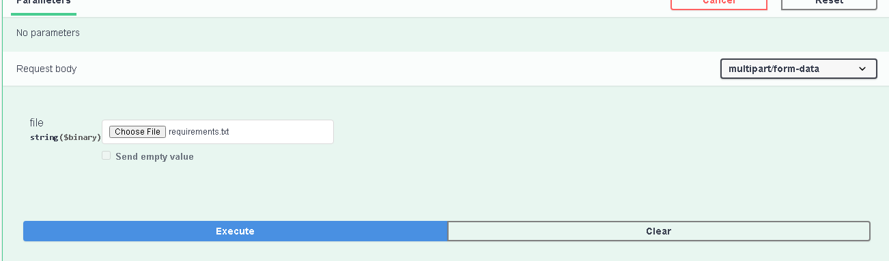
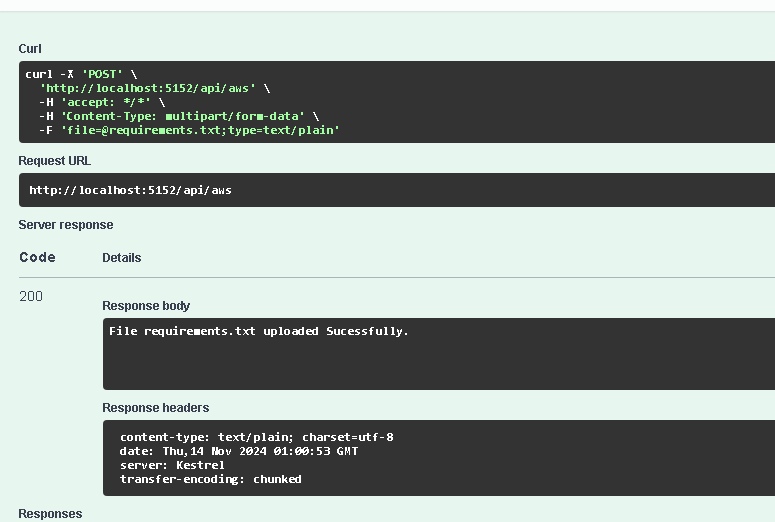
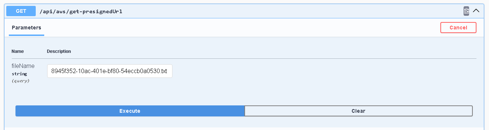
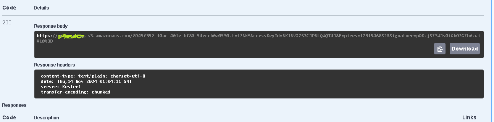

### Consuming Secrets from Amazon SecretsManager with Caching

**Set the Secrets in the Secrets Manager**

**Consume in the .Net Web Api**

**Checking the Cache**

**Upload File to S3**

**Get PreSigned URL**

