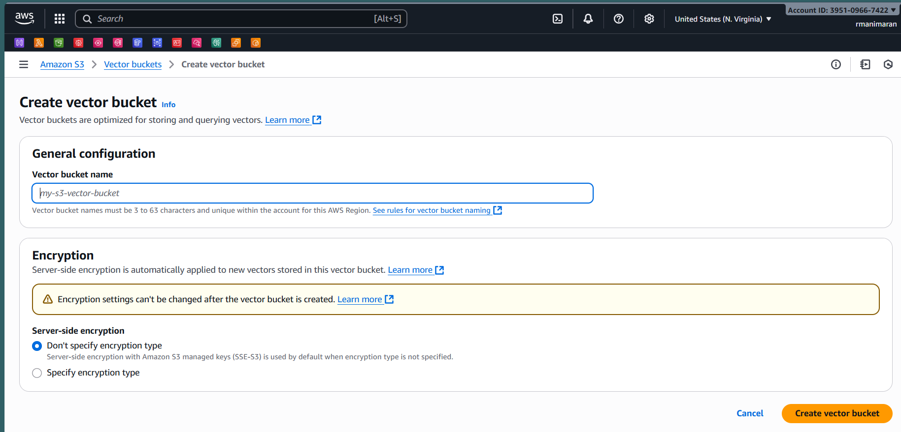
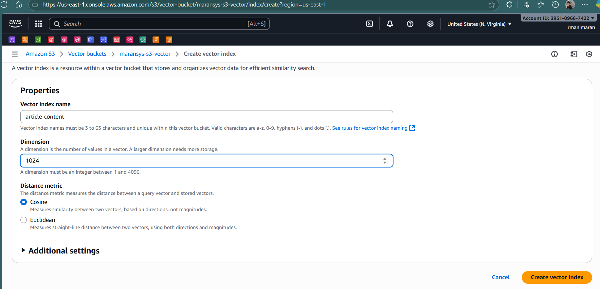
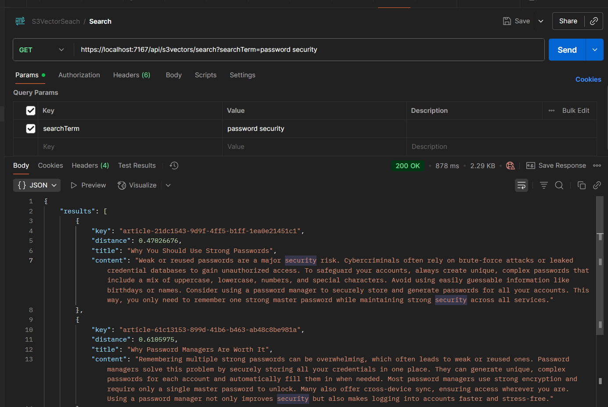

# Amazon S3 Vector Search API

A .NET 9 Web API application that demonstrates vector search capabilities using Amazon S3 Vectors service with AWS Bedrock embeddings. This application allows you to upload documents, generate embeddings, and perform semantic search queries.

## Features

- **Document Upload**: Upload articles and generate embeddings using AWS Bedrock Titan model
- **Vector Search**: Perform semantic search queries to find relevant documents
- **S3 Vector Storage**: Store and manage vectors in Amazon S3 with indexing
- **RESTful API**: Clean API endpoints for all operations
- **Health Monitoring**: Built-in health check endpoint

## Prerequisites

Before running this application, ensure you have:

1. **.NET 9 SDK** installed on your machine
2. **AWS Account** with appropriate permissions
3. **AWS CLI** configured with your credentials
4. **Amazon S3 Vector bucket** created in your AWS account
5. **Vector index** created inside your S3 Vector bucket

## AWS Setup

### Create S3Vector


### Create Index inside S3Vector


## Installation & Setup

### 1. Clone the Repository
```bash
git clone <repository-url>
cd AmazonS3VectorApp
```

### 2. Configure AWS Credentials
Ensure your AWS credentials are configured using one of these methods:
- AWS CLI: `aws configure`
- Environment variables
- IAM roles (if running on EC2)

### 3. Update Configuration
Edit `appsettings.json` with your AWS S3 Vector details:
```json
{
  "AmazonS3VectorsOptions": {
    "EmbeddingModel": "amazon.titan-embed-text-v2:0",
    "VectorBucketName": "your-s3-vector-bucket-name",
    "VectorIndexName": "your-vector-index-name"
  }
}
```

### 4. Install Dependencies
```bash
cd AmazonS3Vectors
dotnet restore
```

### 5. Run the Application
```bash
dotnet run
```

The API will be available at `https://localhost:5001` or `http://localhost:5000`

## API Endpoints

### Health Check
```http
GET /api/s3vectors/health
```
Returns the service health status.

### Upload Documents
```http
POST /api/s3vectors/upload
```
Uploads articles from `Data/HelpfulTips.json`, generates embeddings, and stores them in S3 Vectors.

### Search Documents
```http
GET /api/s3vectors/search?searchTerm=your-search-query
```
Performs semantic search and returns the top 3 most relevant documents.

**Example Response:**
```json
{
  "results": [
    {
      "key": "article-guid",
      "distance": 0.85,
      "title": "Document Title",
      "content": "Document content..."
    }
  ]
}
```

### Delete Vector Index
```http
DELETE /api/s3vectors/deleteVectorIndex/{bucketName}/{indexName}
```
Deletes the specified vector index from the S3 bucket.

## Project Structure

```
AmazonS3VectorApp/
├── AmazonS3Vectors/
│   ├── Data/
│   │   └── HelpfulTips.json          # Sample articles for testing
│   ├── Endpoints/
│   │   └── S3VectorEndpoints.cs      # API endpoint definitions
│   ├── Article.cs                    # Article model
│   ├── ResponseData.cs               # API response model
│   ├── AmazonS3VectorsOptions.cs     # Configuration options
│   ├── Program.cs                    # Application entry point
│   └── appsettings.json              # Configuration file
└── README.md
```

## Key Dependencies

- **AWSSDK.S3Vectors**: Amazon S3 Vectors service SDK
- **AWSSDK.BedrockRuntime**: AWS Bedrock runtime for embeddings
- **Microsoft.SemanticKernel**: Semantic Kernel framework
- **Microsoft.SemanticKernel.Connectors.Amazon**: Amazon connectors for Semantic Kernel

## Usage Examples

### 1. Upload Sample Documents
```bash
curl -X POST https://localhost:5001/api/s3vectors/upload
```

### 2. Search for Documents
```bash
curl "https://localhost:5001/api/s3vectors/search?searchTerm=password security"
```


*semantic search*

### 3. Check Service Health
```bash
curl https://localhost:5001/api/s3vectors/health
```
### Health Check Endpoint
```bash
curl https://localhost:5001/health
```

### Output of health
```json
{
  "status": "Healthy",
  "checks": [
    {
      "component": "S3VectorBucket",
      "status": "Healthy",
      "description": "S3 Vector Bucket 'maransys-s3-vector' exists and accessible"
    }
  ],
  "totalDuration": "00:00:03.7004438"
}
```
## Troubleshooting

### Common Issues

1. **AWS Credentials Not Found**
   - Ensure AWS CLI is configured: `aws configure`
   - Verify IAM permissions for S3 Vectors and Bedrock services

2. **S3 Vector Bucket Not Found**
   - Verify the bucket name in `appsettings.json`
   - Ensure the bucket exists in your AWS account

3. **Bedrock Model Access**
   - Ensure you have access to the Titan embedding model
   - Check your AWS region supports the model

4. **Port Already in Use**
   - Change the port in `Properties/launchSettings.json`
   - Or stop other applications using the same port

## Contributing

1. Fork the repository
2. Create a feature branch
3. Make your changes
4. Test thoroughly
5. Submit a pull request

## License

This project is licensed under the MIT License.

## Support

For issues and questions:
- Check the troubleshooting section above
- Review AWS S3 Vectors documentation
- Open an issue in the repository
