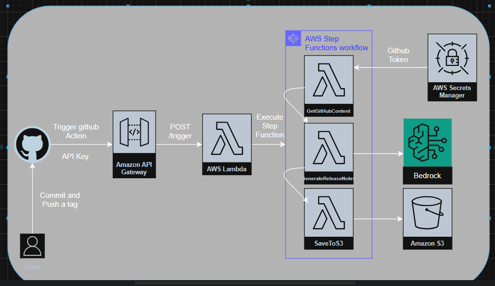
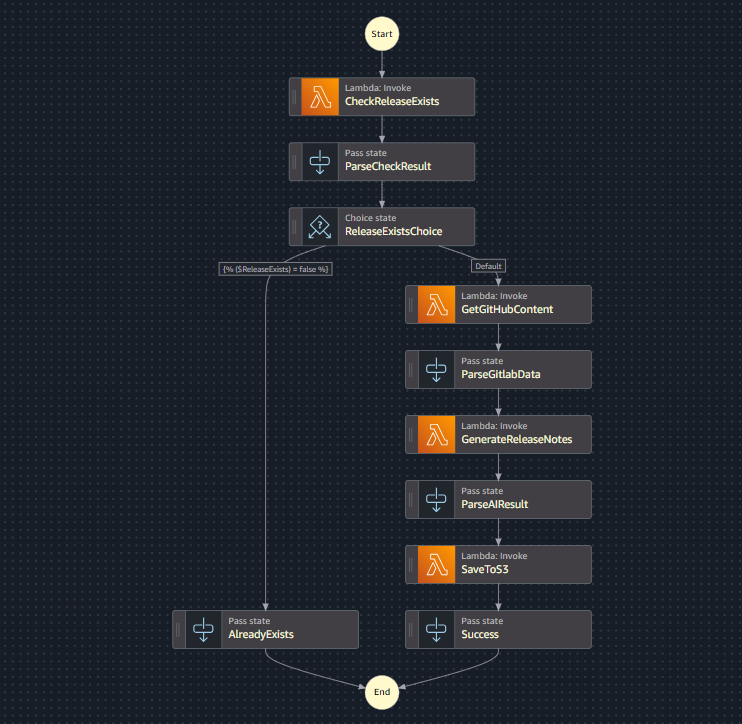

# Release Notes Generator

An automated AWS serverless solution that generates AI-powered release notes from GitHub releases using Step Functions, Lambda, and Amazon Bedrock.

## Architecture


## Step Functions Flow:


## Components

### Lambda Functions
- **ReleaseNotesApp**: API Gateway trigger that starts the Step Function workflow
- **CheckReleaseExists**: Validates if a GitHub release exists for the given tag
- **GetGithubContent**: Fetches commit history and release data from GitHub API
- **GenerateReleaseNotes**: Uses Amazon Bedrock (Claude) to generate executive and technical release notes
- **SaveToS3**: Stores generated release notes in S3 and sends notifications via SNS

### Shared Library
- **SharedLib**: Common data models and utilities shared across Lambda functions

### GitHub Actions
- **release-notes-trigger.yaml**: Automatically triggers release notes generation when new version tags are pushed

## Setup

### Prerequisites
- AWS CLI configured
- .NET 8.0 SDK
- GitHub Personal Access Token
- Amazon Bedrock access (Claude model)

### Environment Variables
- `GITHUB_TOKEN`: GitHub API access token
- `BEDROCK_MODEL_ID`: Bedrock model identifier (default: us.anthropic.claude-3-5-sonnet-20241022-v2:0)
- `S3_BUCKET`: S3 bucket for storing release notes
- `SNS_TOPIC_ARN`: SNS topic for notifications

### GitHub Secrets
- `RELEASE_NOTIFY_EMAILS`: Email list for notifications
- `RELEASE_SNS_ARN`: SNS topic ARN
- `API_GATEWAY_KEY`: API Gateway API key
- `API_GATEWAY_URL`: API Gateway endpoint URL

## Usage

### Manual Trigger
POST to API Gateway endpoint:
```json
{
  "releaseUrl": "https://github.com/owner/repo/releases/tag/v1.0.0",
  "tagName": "v1.0.0", 
  "targetEmails": ["team@example.com"],
  "snsArn": "arn:aws:sns:region:account:topic"
}
```

### Automatic Trigger
Push a version tag to trigger GitHub Actions:
```bash
git tag v1.0.0
git push origin v1.0.0
```

## Output
Generates dual-audience release notes:
- **Executive Summary**: Business-focused overview
- **Technical Details**: Developer-focused technical changes

Notes are stored in S3 and distributed via email through SNS.
