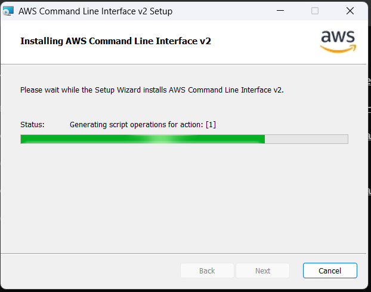
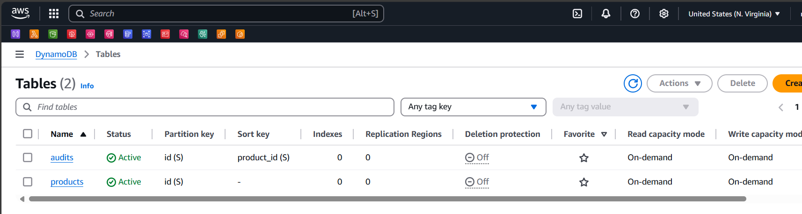
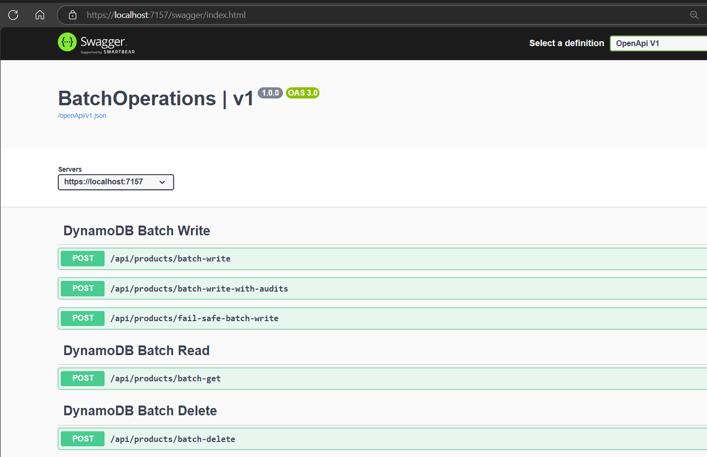
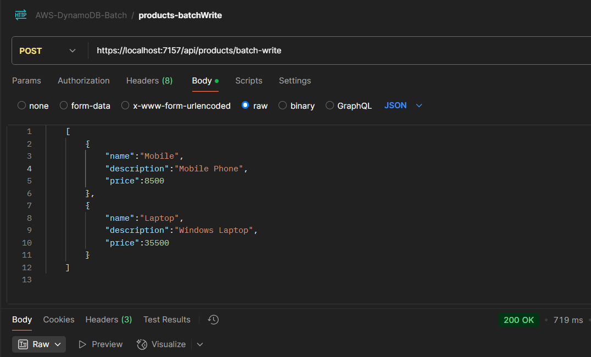
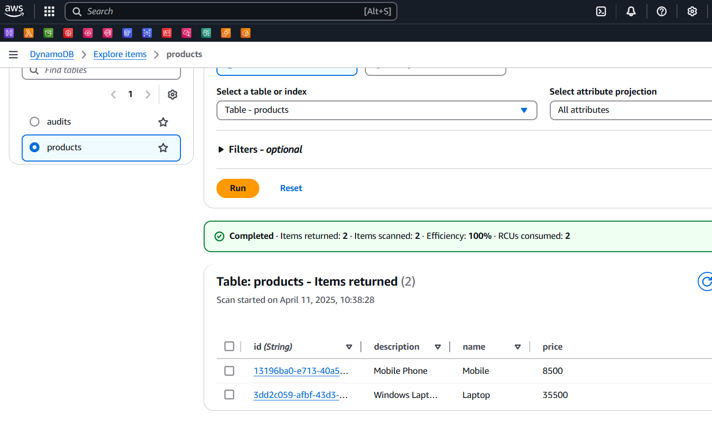
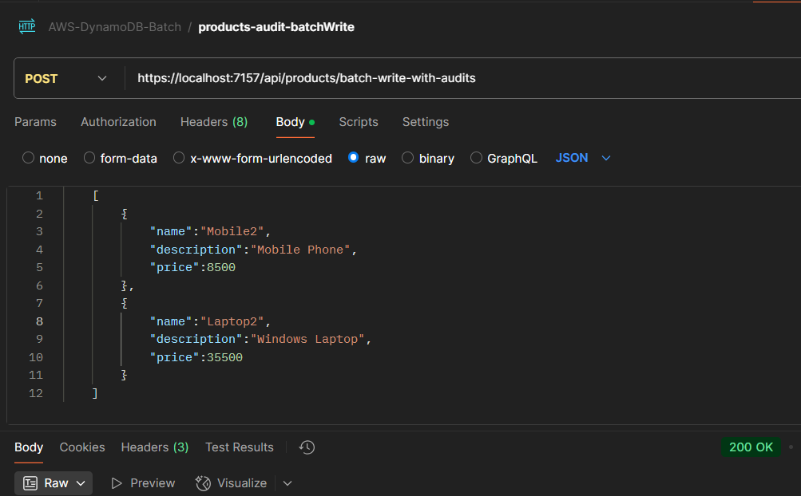
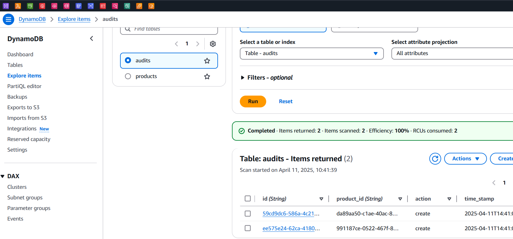
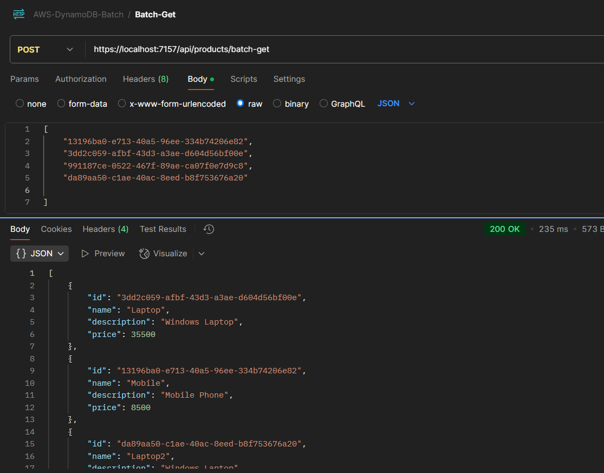
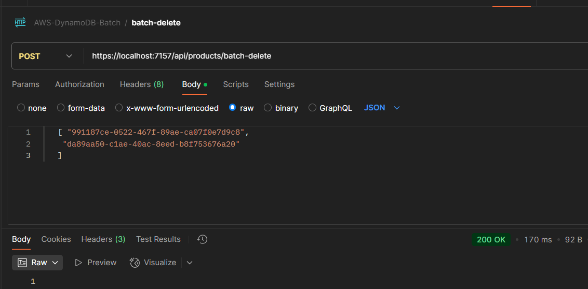
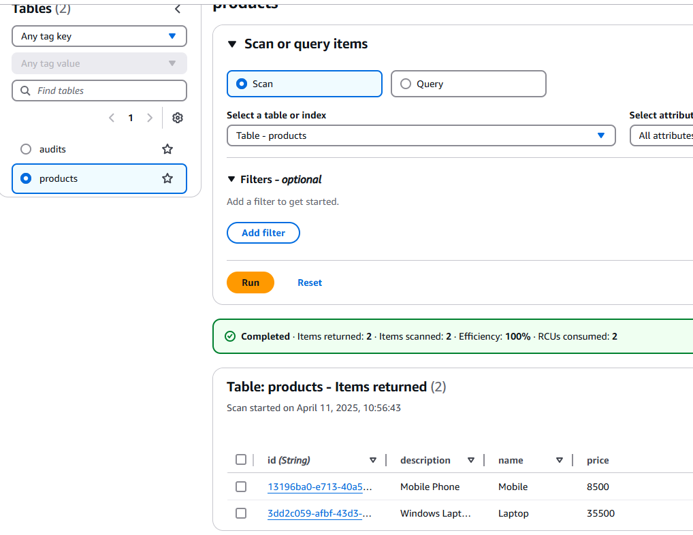

# Perform Batch Operations in AWS DynamoDB Tables
This project demonstrates how to perform batch operations (read and write) with AWS DynamoDB using .NET Core. It showcases efficient ways to handle multiple items in a single request, reducing API calls and improving performance when working with DynamoDB tables.

## Overview

This application demonstrates:
- Batch write operations (PutItem and DeleteItem)
- Batch read operations across multiple tables
- Handling unprocessed items and partial failures
- Best practices for bulk data operations in DynamoDB

## Prerequisites

- AWS Account with appropriate permissions
- .NET Core SDK
- AWS CLI installed and configured
- Basic understanding of DynamoDB concepts


-  Install the dependent Nuget packages.

```powershell
Install-Package AWSSDK.Core
Install-Package AWSSDK.DynamoDBv2
Install-Package AWSSDK.Extensions.NETCore.Setup
```

## Install AWS CLI


### Created Dynamodb tables products and audits



## DynamoDB Batch Write Operations

- Batch write operations are used to perform multiple `PutItem` or `DeleteItem` actions in a single request.
- Suitable for bulk data import or modifications or cleaning large number of records.
- Each `BatchWriteItem` request can handle upto 25 items or 16MB of data, which ever comes first.
- This minimize the network overhead.
- But as they are not transactional, partial failure may occur, leaving some items unprocessed.
- In such cases, unprocessed items are returned, we can retry them.

## DynamoDB Batch Read Operations

- Batch read operations enable fetching multiple items across one or more tables in a single request using `BatchGetItem`.
- Efficient for retrieving small to moderate amounts of data without making multiple network calls.
- Each `BatchGetItem` can hand;e upto 100 items or 16MB of data, which ever is smaller.
- Ideal for retreiving user profiles, product details or audit logs for a set of IDs.
- It does not support conditional reads or strong consistency (only eventual consistency is available by default)

## Endpoints


## Perform Batch Write



### Check the insert in DynamoDB Table





## Perform Batch Write on multiple Tables





## Perform Batch Delete


